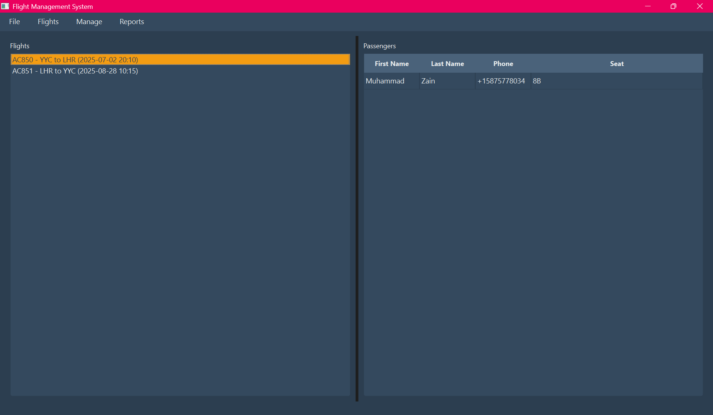
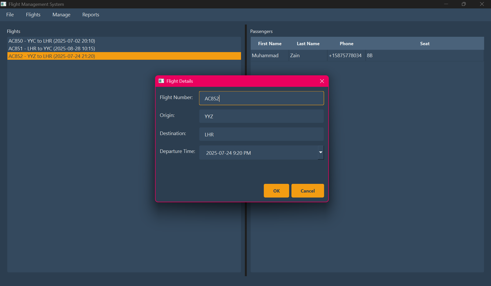
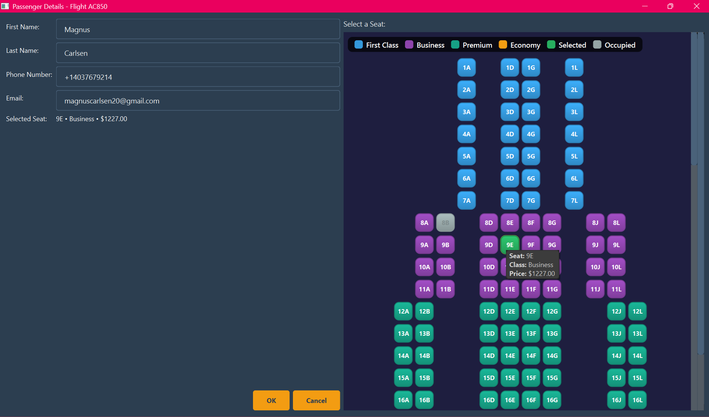
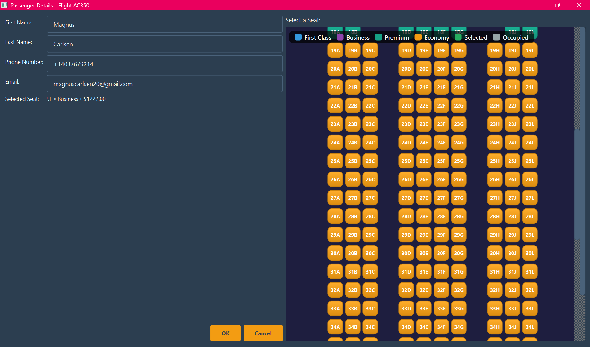
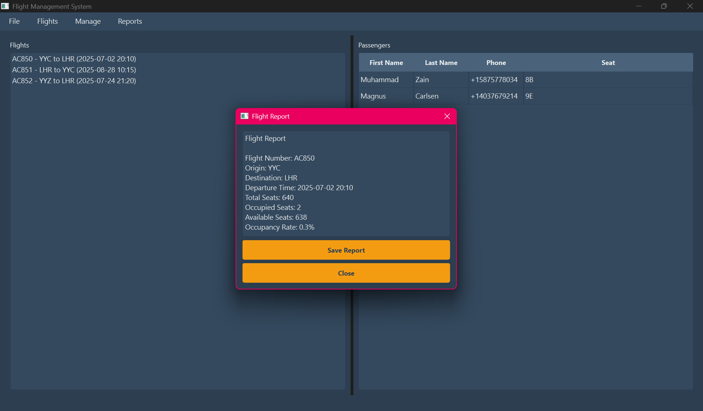
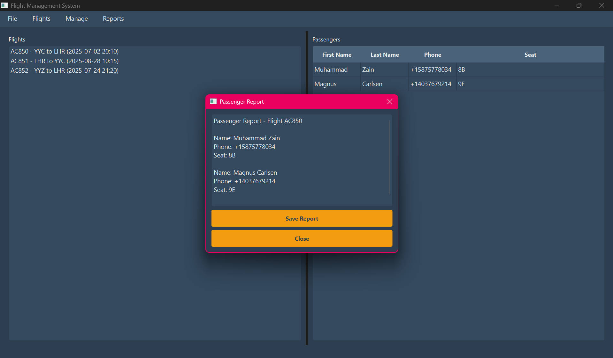

<!--
Masterclass README for Flight Operations Manager
-->

<a name="flight-operations-manager"></a>
# ✈️ Flight Operations Manager

<div align="center">


*A modern, robust, and user-friendly flight management system for airlines and travel agencies.*

</div>

---

## 📋 Table of Contents
- [Project Evolution](#project-evolution)
- [Features](#features)
- [Screenshots](#screenshots)
- [System Requirements](#system-requirements)
- [Installation Guide](#installation-guide)
- [Usage Guide](#usage-guide)
- [Architecture](#architecture)
- [Data Management](#data-management)
- [Development Journey](#development-journey)
- [Testing & Quality Assurance](#testing--quality-assurance)
- [Contributing](#contributing)
- [License](#license)
- [Contact](#contact)

---

<a name="project-evolution"></a>
## 🚀 Project Evolution

**Flight Operations Manager** began as a university course project for ENSF-337 (Programming Fundamentals for Software and Computer). What started as a basic assignment has since been transformed into a professional, feature-rich application—showcasing modern C++/Qt development, advanced UI/UX, and robust data management. This journey was powered by hands-on coding, iterative design, and AI-assisted development using Cursor and Windsurf.

---

<a name="features"></a>
## ✨ Features

- **Flight Management**: Create, edit, and manage flights with detailed scheduling and route info.
- **Passenger Management**: Add, edit, and search passengers; track bookings and special requests.
- **Interactive Seat Map**: Real-time seat selection, class differentiation, and vibrant visual feedback.
- **Data Visualization**: Dynamic reports for flights, passengers, and revenue.
- **Modern UI/UX**: Professional, accessible, and consistent design with live validation and tooltips.
- [Dual Storage](#data-management): File-based (JSON/CSV) and SQLite database support.
- **Export & Reports**: Generate and export reports in multiple formats.
- **Accessibility**: Keyboard navigation, tooltips, and high-contrast visuals.

---

<a name="screenshots"></a>
## 🖼️ Screenshots

### Main Window

*The central dashboard for managing flights and passengers.*

### Flight Dialog

*Dialog for creating and editing flight details.*

### Passenger Dialog

*Dialog for adding/editing passengers, with integrated seat map.*

### Interactive Seat Map

*Vibrant, interactive seat map with class and selection highlights.*

### Flight Report

*Detailed flight report with export options.*

### Passenger Report

*Comprehensive passenger report for selected flights.*

---

<a name="system-requirements"></a>
## 🛠️ System Requirements

**Software:**
- Windows 10/11, macOS 10.15+, or Linux (Ubuntu 20.04+)
- CMake 3.16+
- Qt 5.15+ or Qt 6.x
- C++17 compatible compiler
- Git

**Hardware:**
- Minimum: 4GB RAM, Dual-core CPU, 1GB disk
- Recommended: 8GB RAM, Quad-core CPU, 2GB disk, 1920x1080 display

---

<a name="installation-guide"></a>
## 📥 Installation Guide

1. **Install Qt Framework**
   ```bash
   # Windows
   winget install Qt.Qt
   # macOS
   brew install qt
   # Ubuntu
   sudo apt install qt6-base-dev
   ```
2. **Install CMake**
   ```bash
   # Windows
   winget install Kitware.CMake
   # macOS
   brew install cmake
   # Ubuntu
   sudo apt install cmake
   ```
3. **Clone and Build**
   ```bash
   git clone https://github.com/yourusername/Flight_Operations_Manager.git
   cd Flight_Operations_Manager
   mkdir build && cd build
   cmake ..
   cmake --build .
   ```
4. **Run the Application**
   - Launch the built executable from the build directory.

---

<a name="usage-guide"></a>
## 📚 Usage Guide

- **First Launch:** Configure airline info and database settings.
- **Managing Flights:** Use the main window to add/edit/delete flights.
- **Passenger Operations:** Add, edit, or remove passengers; assign seats via the seat map.
- **Seat Selection:** Click on available seats in the map for real-time assignment.
- **Reports:** Generate and export flight and passenger reports from the main window.

---

<a name="architecture"></a>
## 🏗 Architecture

```
Flight_Operations_Manager/
├── src/
│   ├── gui/               # GUI implementations
│   ├── models/            # Data models
│   └── database/          # Database handlers
├── include/               # Header files
├── docs/screenshots/      # Screenshots for documentation
└── ...
```

**Design Patterns:** Singleton (DB), Observer (UI), Factory, Strategy, Command.

---

<a name="data-management"></a>
## 💾 Data Management

- **File-based Storage:** JSON/CSV for easy backup and export.
- **SQLite Database:** For robust, scalable data management.
- **Export:** Reports and data can be exported to CSV and TXT.

---

<a name="development-journey"></a>
## 🛠️ Development Journey

This project's transformation from a simple course assignment to a professional-grade application was made possible by:

- **Iterative Design:** Multiple cycles of feature addition, UI/UX polish, and bug fixing.
- **AI-Assisted Development:** Leveraging Cursor and Windsurf for:
  - Debugging complex seat map and UI issues
  - Refactoring and code cleanup
  - Implementing accessibility and modern design
  - Live input validation, tooltips, and keyboard navigation
  - Ensuring data consistency and robust error handling
- **Collaboration:** The assistant (AI) provided targeted fixes, design suggestions, and code reviews, resulting in a visually consistent, accessible, and reliable product.

---

<a name="testing--quality-assurance"></a>
## 🧪 Testing & Quality Assurance

- **Manual Testing:** All features tested across Windows and Linux.
- **Automated Tests:** (If present) Run with `ctest` in the build directory.
- **Code Review:** Continuous review and improvement using AI tools.

---

<a name="contributing"></a>
## 🤝 Contributing

1. Fork the repository
2. Create a feature branch
3. Make your changes
4. Submit a pull request

**Coding Standards:**
- C++17 best practices
- Qt conventions
- Document public APIs
- Write tests for new features

---

<a name="license"></a>
## 📄 License

This project is licensed under the MIT License. See [LICENSE](LICENSE) for details.

---

<a name="contact"></a>
## 📞 Contact

- **Project Maintainer:** Muhammad Zain
- **Email:** muhammadzain0476@gmail.com
- **GitHub Issues:** For bug reports and feature requests

<div align="center">

Made with ❤️ using Cursor, Windsurf, and the power of modern C++/Qt

[⬆ Back to Top](#-flight-operations-manager)

</div> 